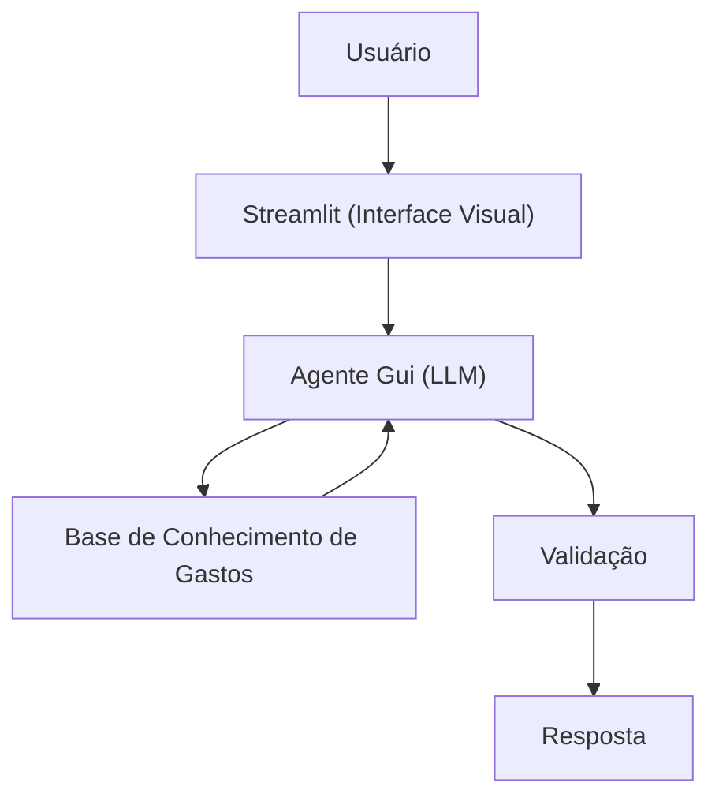

# Documentação do Agente

## Caso de Uso

### Problema
> Qual problema financeiro seu agente resolve?

As pessoas têm dificuldade em acompanhar seus gastos no dia a dia e só percebem que estouraram o orçamento quando o mês já acabou.

### Solução
> Como o agente resolve esse problema de forma proativa?

O agente monitora automaticamente os gastos do usuário, categorizando as despesas e comparando-as com limites definidos por categoria e pelo orçamento total do mês. 

### Público-Alvo
> Quem vai usar esse agente?

Pessoas que querem controlar melhor suas finanças pessoais sem depender de planilhas complexas.

---

## Persona e Tom de Voz

### Nome do Agente
Gui (“guia” financeiro)
### Personalidade
> Como o agente se comporta? (ex: consultivo, direto, educativo)

O Gui é direto, pé no chão e prático. Ele não enrola: mostra onde o dinheiro está indo e como evitar estourar o orçamento, sempre de um jeito simples de entender.

### Tom de Comunicação
> Formal, informal, técnico, acessível?

Tom informal, leve e acessível, como um amigo que entende de finanças.

### Exemplos de Linguagem
- Saudação: Olá! Eu sou o Gui, seu alerta de gastos em tempo real. Bora ver onde seu dinheiro está indo hoje?
- Confirmação: Fechado, entendi esse gasto. Vou checar rapidinho se ele pesa no seu orçamento e já te conto.
- Erro/Limitação: Não tenho dado suficiente para responder isso com segurança agora, mas posso te mostrar como seus gastos estão hoje e onde dá para ajustar.

---

## Arquitetura

### Diagrama

### Componentes

| Componente | Descrição |
|------------|-----------|
| Interface | [Streamlit](https://streamlit.io/)|
| LLM | [Ollama](https://ollama.com/) |
| Base de Conhecimento | JSON/CSV mockados na pasta `data` |
| Validação | Checagem de alucinações |

---

## Segurança e Anti-Alucinação

### Estratégias Adotadas

- [x] Agente só responde com base nos dados disponíveis (JSON/CSV).
- [x] Evita inventar valores ou recomendações quando não há informação suficiente.
- [x] Explica de forma clara quando não consegue responder com segurança.

### Limitações Declaradas
> O que o agente NÃO faz?
- NÃO substitui um consultor financeiro humano.
- NÃO faz previsões de retorno de investimento.
- NÃO acessa dados reais fora da base fornecida.
